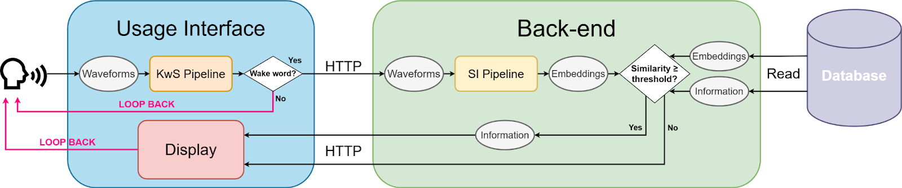
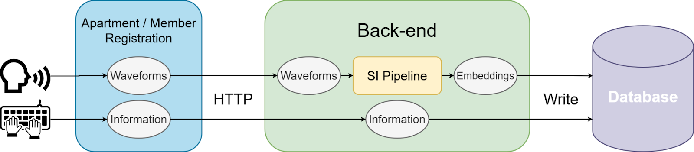

# 🇻🇳 Vietnamese Keyword-Based Speaker Identification System  
*A web-based AI system for wake-word detection and speaker identification for smart home access control.*

---

## Introduction

This project develops a voice-based identity authentication system using the Vietnamese wake word **“Quad Team ơi”**.  
The system integrates two AI models operating sequentially:

1. **Keyword Spotting (KwS)** – Detects whether the user has spoken the correct wake word.  
2. **Speaker Identification (SI)** – Identifies the user based on voice embeddings.

The system is designed for **Smart Home applications**, enabling password-free authentication using only the user's voice.

---

## Table of Contents
- [Introduction](#introduction)
- [System Illustration](#system-illustration)
- [Video Demo](#video-demo)
- [System Architecture](#system-architecture)
- [Detailed Pipeline](#detailed-pipeline)
- [AI Models](#ai-models)
- [Dataset](#dataset)
- [Installation & Execution](#installation--execution)
- [Team Members](#team-members)

---

## System Illustration

> You may add system illustrations here.  
> Create the folder:  
> ```
> /images
> ```  
> Then insert the images:
> ```md
> 
> 
> ```

---

## System Architecture

### **Frontend**
- HTML templates integrated into Django  
- Runs the **KwS ONNX model** directly in the browser  
- Records audio and sends it to the backend via API

### **Backend**
- Django Framework  
- Receives and processes audio input  
- Executes the SI model for authentication  
- Manages users, rooms, and access permissions

---

## Detailed Pipeline

1. The user logs into an existing room or creates a new room.  
2. If unregistered, the user enters their name, records **three voice samples**, and selects an access role.  
3. Once inside the room, the user clicks **“Start Listening”**.  
4. The **KwS ONNX model** on the frontend detects the wake word **“Quad Team ơi”**.  
5. If the wake word is correct → audio is sent to the backend.  
6. The backend runs the **SI model** to compare embeddings with the user’s registered samples.  
7. If the similarity score exceeds the threshold → authentication succeeds → the user’s assigned permissions are displayed.

---

## AI Models

### **Keyword Spotting (KwS)**
- **Main model:** CNN + BiLSTM  
- **Deployment:**
  - Trained with Python  
  - Converted to ONNX for browser-based inference

---

### **Speaker Identification (SI)**
- **Main model:** MFA-Conformer  
- **Operation:**
  - Generates embedding from the recorded sample  
  - Computes cosine similarity with the user’s three registered samples  
  - Authentication determined by thresholding

---

## Installation & Execution

```bash
pip install -r requirements.txt

python manage.py migrate

python manage.py runserver
``` 

## Member group
- Member 1: Nguyễn Phúc Điền
- Member 2: Đỗ Quốc Cường
- Member 3: Lý Bảo Long
- Member 4: Phan Tấn Phát
